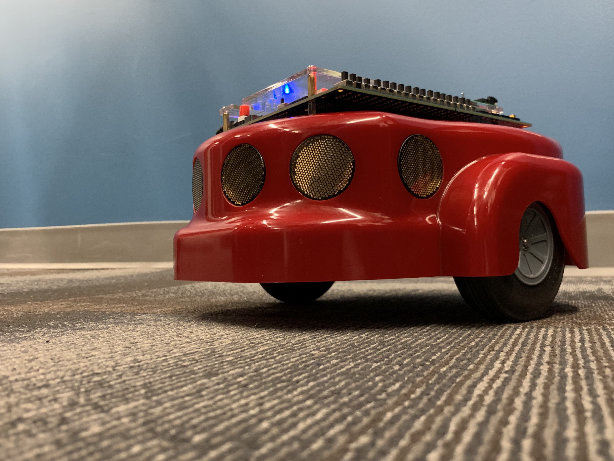

# RunningRock

RunningRock is an autonomous DE2Bot project completed for ECE 2031 Spring 2019 at Georgia Tech. 
Further description of the project and results can be found in the [Postmortem](Running%20Rock%20Postmortem.pdf).

DE2Bot—the platform used for this project—is a modified Amigo Bot equipped with a DE2 FPGA. A primitive computer implemented in VHDL was used to run the logic for intelligent robot behavior. The logic was written in Simple Computer Assembly and can be found [here](src/Runner.asm) among other Quartus II project files. 
